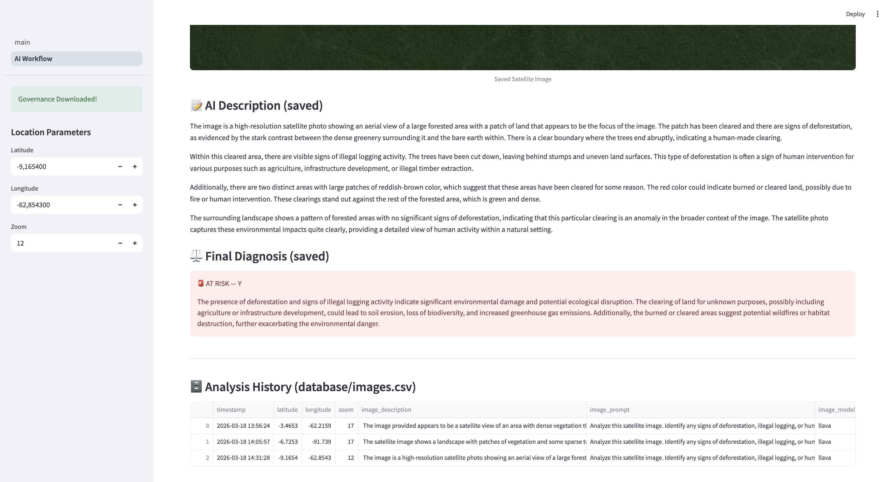
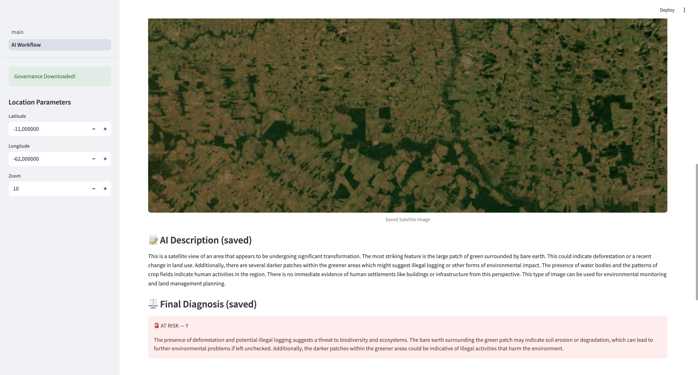
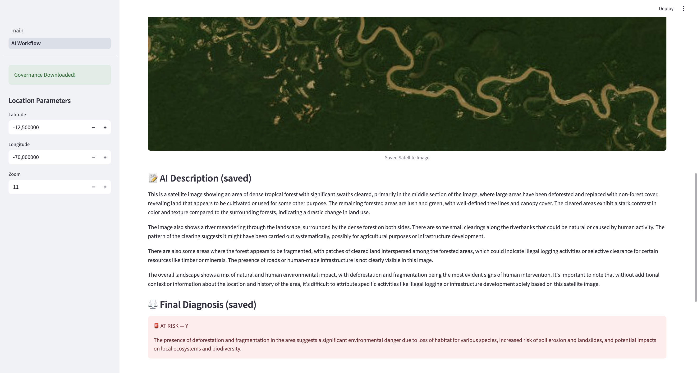

# Group_H
## Team Members
Ana Reis - 70047@novasbe.pt
Duarte Maria Carvalho - 59479@novasbe.pt
Kaltoum El Glaoui Hamdellah - 73174@novasbe.pt
Gabriel Vieira - 52736@novasbe.pt

## Installation and Setup

### Requirements
- Python 3.10+
- [Ollama](https://ollama.com/download) installed and running

### Steps
1. Clone the repository:
```bash
git clone https://github.com/AnaReis12345/Group_H.git
cd Group_H
```
2. Install dependencies:
```bash
conda install -c conda-forge geopandas
/opt/anaconda3/bin/pip install streamlit staticmap pandas pyyaml requests
```
3. Pull the required AI models:
```bash
ollama pull llava
ollama pull llama3
```
4. Run the app:
```bash
streamlit run main.py
```


## SDGs — How This Project Contributes

This project directly supports three of the United Nations Sustainable Development Goals:

**SDG 15 — Life on Land:** The core purpose of this tool is to monitor and identify threats to terrestrial ecosystems. By analysing satellite imagery with AI, the app can detect deforestation, illegal logging, and land degradation in real time, helping conservation efforts target the most at-risk areas.

**SDG 13 — Climate Action:** Deforestation is one of the leading causes of greenhouse gas emissions. By identifying areas of forest loss early, this tool supports climate monitoring efforts and can help organisations take action before damage becomes irreversible.

**SDG 17 — Partnerships for the Goals:** This project is built entirely on free and open-source tools — Python, Streamlit, Ollama, and public satellite imagery. This means it can be freely adopted and adapted by NGOs, governments, and researchers around the world, lowering the barrier to environmental monitoring.


## Examples of Environmental Danger Detection

### Example 1 — Deforested Amazon, Brazil (-9.1654, -62.8543)

The AI identified illegal logging activity and burned land, flagging the area as AT RISK.

### Example 2 — Rondônia, Brazil (-11.0000, -62.0000)

The AI detected significant land transformation and bare earth patches indicating deforestation, flagging the area as AT RISK.

### Example 3 — Madre de Dios, Peru (-12.5000, -70.0000)

The AI identified forest fragmentation and systematic clearing consistent with illegal logging or mining, flagging the area as AT RISK.